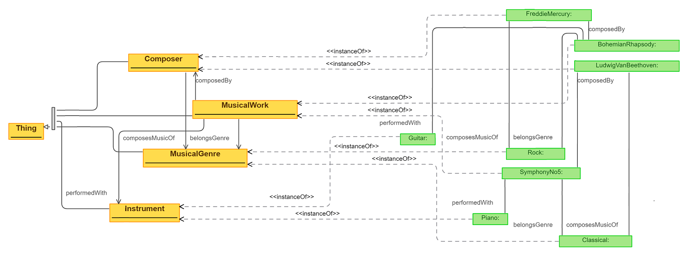

# Musicology Ontology

## Done by Fernando González Sanz and Diego Rodriguez de Roa (Erasmus Student)
For more information here you have the report.
### RDF Graph

# Large language model
We used the model [meta-llama](https://huggingface.co/meta-llama/Meta-Llama-3-8B-Instruct) to ask it about the ontology

# Competency questions
We asked to the LLM about [three competency questions](./competency-questions/).

The solutions to these questions are in [Project.ipnyb](./Project.ipynb)

# Conclusion
Now, we can ask different questions in natural language and the model can answer them.

